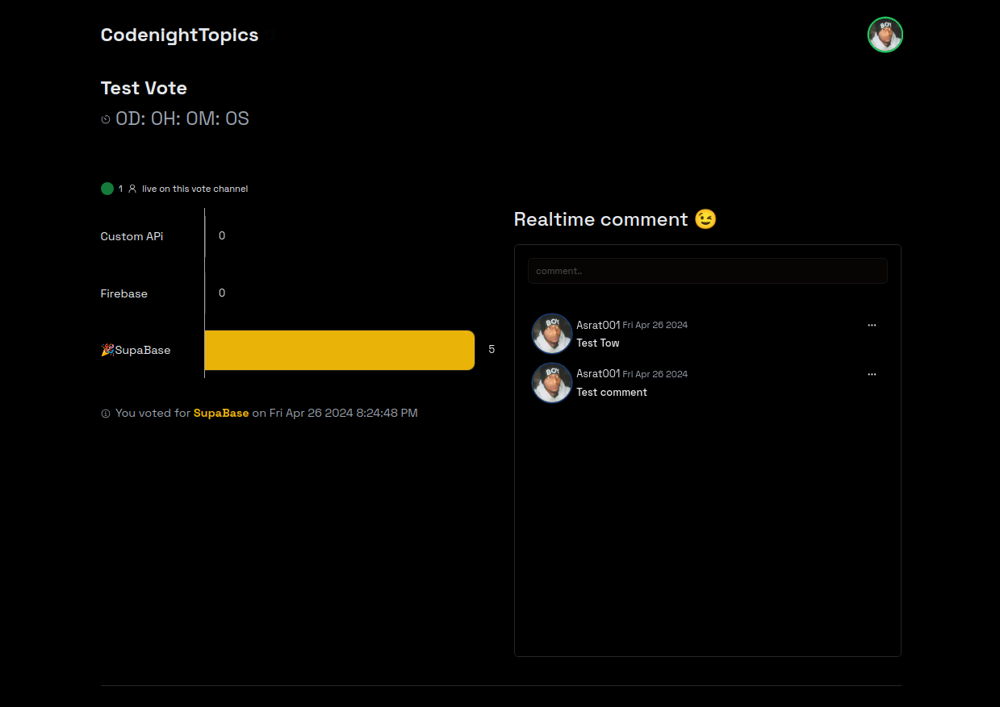

# 👋 Next.js + Supabase Realtime  Application

# CodeNight Topics



```bash
npm i
npm run dev
```

Open [http://localhost:3000](http://localhost:3000) with your browser to see the result.

## Learn More

To learn more about Next.js and Supbase, take a look at the following resources:

-   [Supabase](https://supabase.com/)
-   [Next.js Documentation](https://nextjs.org/docs) - learn about Next.js features and API.
-   [Learn Next.js](https://nextjs.org/learn) - an interactive Next.js tutorial.

## If you went to support Me?


